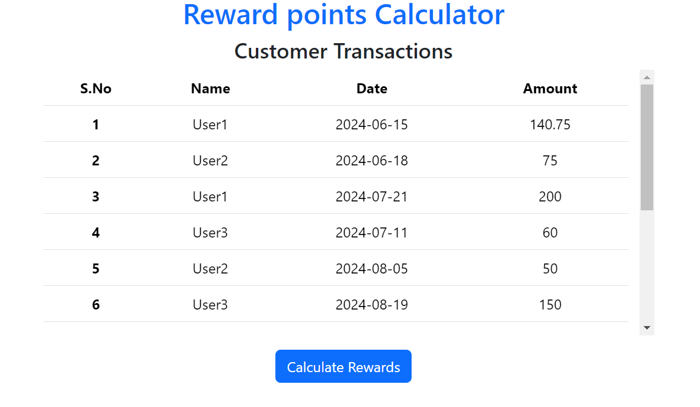
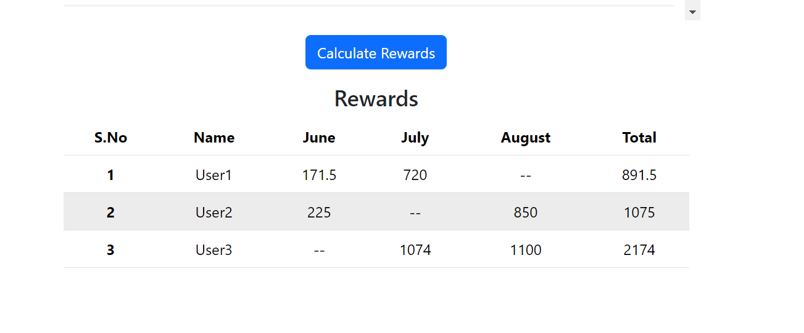
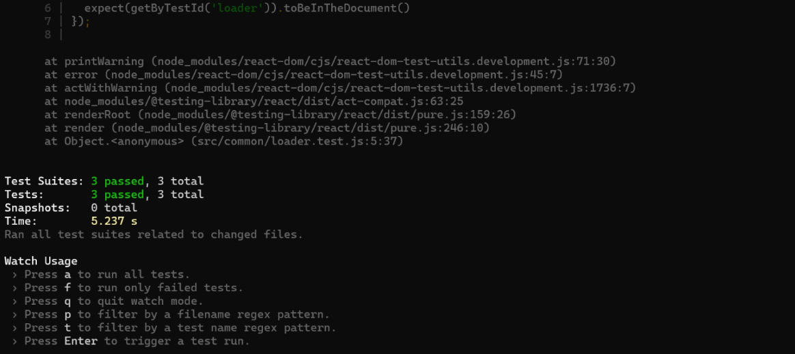

Overview:
This project is for calculating the reward points for the customer transactions

Step1:
Initially all trasactions data will be loaded in this table

Step2:
Later when user click "Calculate Rewards" buttons, reward points will be calculated based on conditions and displayed in table

To run this project use below command:
npm start in main folder

Unit Test case results are attached below:
